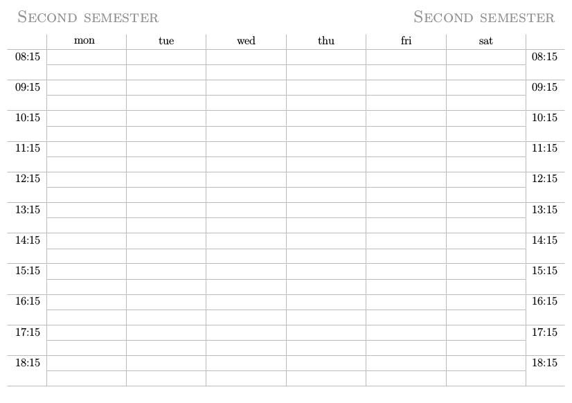

# TeXalendar: print your own weekly planner

Features:
* LaTeX powered
* automated build for any year
* printable file ready for binding
* final size A6, but printable on common A4 printers
* optional two-semester timetable
* academic format: September to September year
* yearly format: January to December year
* customizable
* many languages supported




## Printing
1. run `$ make imposition.pdf`
1. print `imposition.pdf`, double sided on A4 paper
1. cut horizontally to A5 size
1. fold vertically to A6 size
1. glue the spines together as in the perfect binding technique
1. finish the planner by adding a cover of your choice

If you want to use another binding method, check out all the other `.pdf` files that are generated, you'll probably find something useful.

## Customization
You can edit `config.ini`

```ini
[Planner]
first_year = 2023
# Print time-table at beginning of planner:
time_table = True
# Yearly format is January to December,
# academic is September to September of following year
# year_format = yearly
year_format = academic

[Localisation]
# Language detected from system's locale
language = auto
# or set manually, eg:
# language = en_US.utf8

first_semester_label = First Semester
second_semester_label = Second Semester

[Preferences]
font = default
# font = Gentium
week_days_abbreviated = True
months_abbreviated = False
```

## Troubleshooting
### No text is showing, there are missing characters
Make sure the font has all the characters needed for your language. Some good multilingual font choices are
[Gentium](https://software.sil.org/gentium/)
and
[EB Garamond](http://www.georgduffner.at/ebgaramond/download.html).

### The layout of timetables is broken
This can happen if weekdays have long names in your language. Try again with `week_days_abbreviated = True` in `config.ini`.

### Not all pdf files are generated
If you get this error message:
```
make: mutool: No such file or directory
```
you need to install `mupdf` and re-run.
