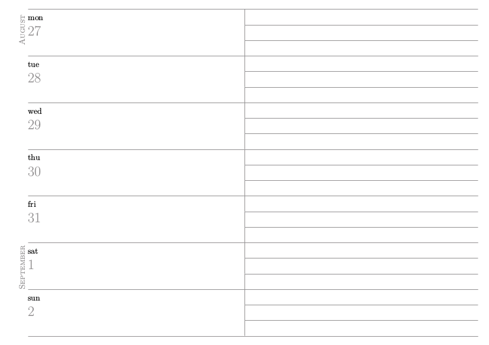

## Weekly planner
* LaTeX powered
* rendered ready for printing and binding 
* A6 final size
* academic format: weekly timetable and September to September year
* customizable font, color scheme and printing layout
* automated build, just run ```make imposition.pdf```




## Default printing method
* print ```imposition.pdf```, double sided on A4 paper (16 sheets total)
* cut to A5 size
* fold to A6 size
* do perfect binding
